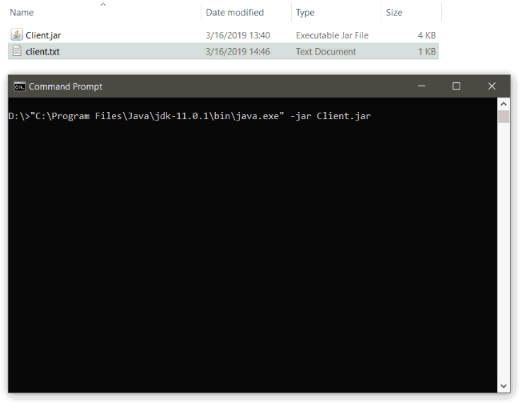

# Remote command executor

A java application made using sockets, which lets you execute linux shell commands remotely. You can also send files using *send-file*, and receive files using *get-file*.

## How to Run

```
sudo java -jar Client/Server.jar
```

## License

This project is licensed under the MIT License - see the [LICENSE](LICENSE) file for details